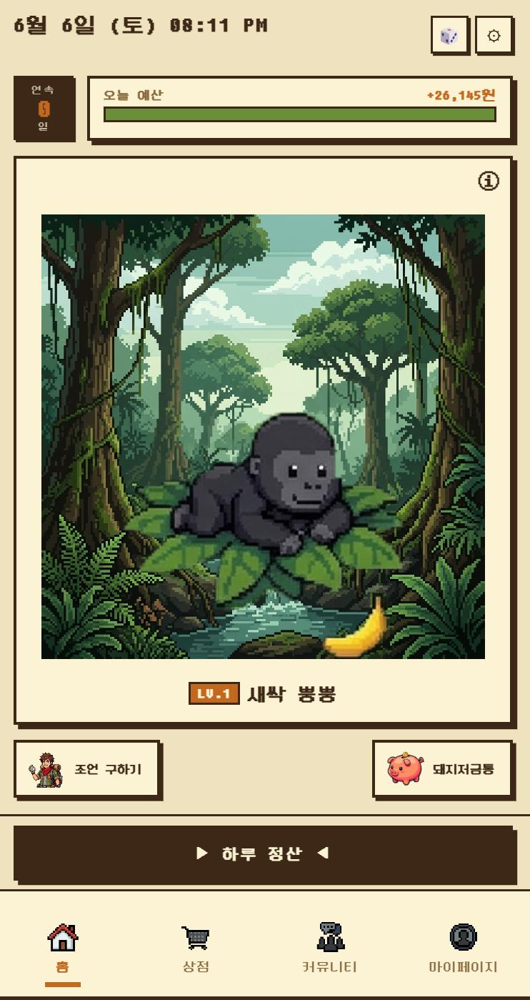
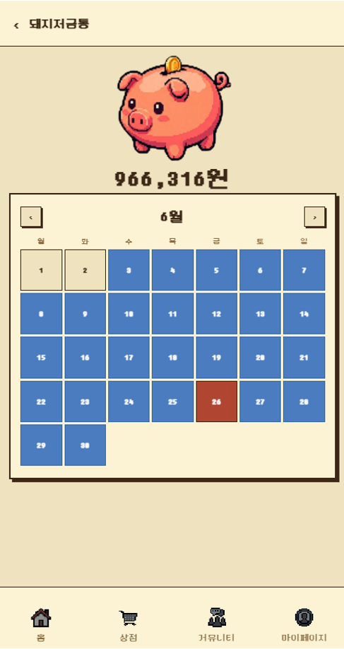
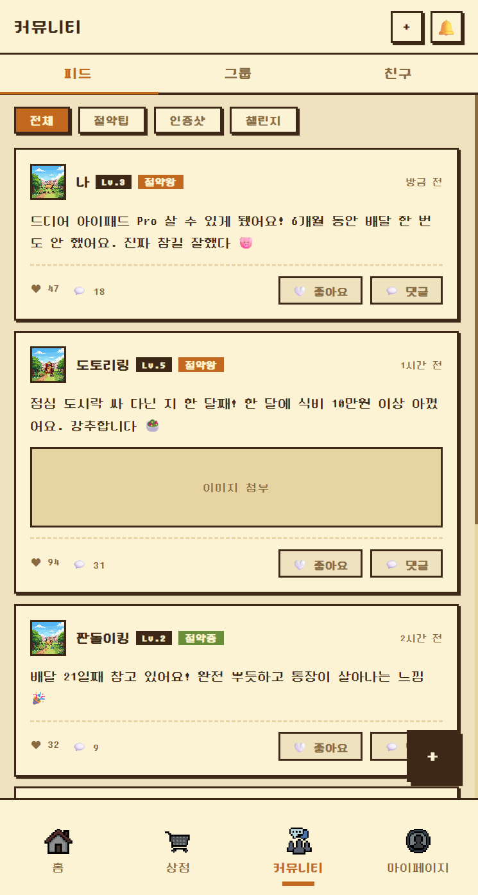
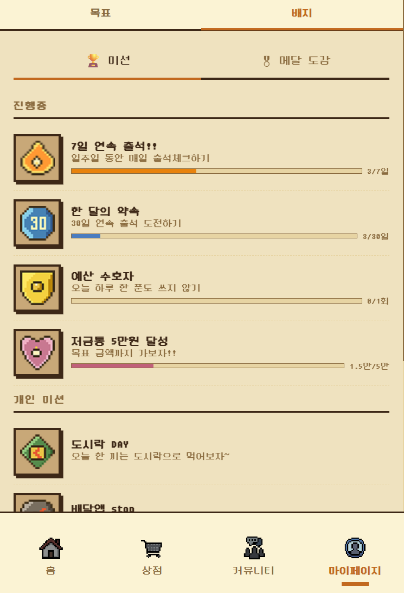
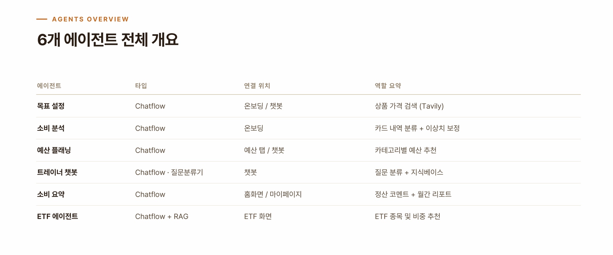

# 주머니 (ZooMoney)

**돈을 모으는 재미를 캐릭터 육성으로.** 목표 상품을 정하면 AI가 하루 예산을 짜주고, 그 예산을 지킬 때마다 캐릭터가 자라는 저축 습관 앱입니다.

> 2026-1 캡스톤 프로젝트 · 기획과 디자인은 팀원과 함께, 프론트엔드 구현과 Dify AI 에이전트 설계는 **1인 개발**로 맡았습니다. Claude Code와의 바이브 코딩으로 제작했습니다.

<p align="center">
  
  
  
  
  
</p>

**🔗 라이브 데모**: https://hyunbean.github.io/ZooMoney/
> 데모는 저축 로직을 전부 체험할 수 있지만, API 키는 보안상 배포에 포함하지 않아 **AI 기능(가격 검색, 트레이너 챗봇, 예산 분석, ETF 추천)은 응답하지 않습니다.** 로컬에서 직접 키를 설정하면 전체 기능을 사용할 수 있어요 ([아래 참고](#dify-ai-기능-연동하기)).

---

## 한눈에 보기

- **AI 온보딩** — 갖고 싶은 상품을 말하면 Dify 에이전트가 실시간 웹 검색(Tavily)으로 가격을 찾아오고, 카드 지출 내역을 업로드하면 자동으로 카테고리 분류·이상치 탐지까지 해서 하루 예산을 설계해줍니다.
- **캐릭터 육성형 동기부여** — 8종 동물 캐릭터가 저축 진행률에 따라 5단계로 성장하고, 예산을 못 지킨 다음 날엔 표정이 시무룩해집니다. 22종 배지와 연속 출석 스트릭으로 계속 돌아오게 만듭니다.
- **AI 트레이너 챗봇** — 절약 팁, 충동구매 상담, 목표 변경, 실시간 예산 계산까지 인텐트를 분류해 대응하는 대화형 코치.
- **AI 예산 분석 & ETF 코치** — 카테고리별 지출을 분석해 절감 가능한 예산을 제안하고, 목표를 초과 달성하면 여윳돈으로 시작할 ETF를 추천합니다.
- **소셜** — 친구 추가, 예산 성공률 랭킹, 절약 인증 피드, 공동 목표 그룹.

기능별 자세한 설명은 [FEATURES.md](FEATURES.md)에 정리해뒀습니다.

---

## 기술 스택

| 영역 | 사용 기술 |
|---|---|
| 프론트엔드 | Vanilla JS (프레임워크 없음), CSS Custom Properties |
| 상태 관리 | 자체 pub/sub 상태 관리자 (`js/state.js`) + `localStorage` 영속화 |
| AI | [Dify](https://dify.ai) 워크플로 6종 (GPT-4o-mini 기반, Tavily 웹검색·RAG 지식베이스 연동) |
| 테스트 | Node.js 내장 테스트 러너 (`node --test`) |

바닐라 JS로 프레임워크 없이 만든 이유는 빠른 프로토타이핑과, AI 에이전트와의 상태 흐름을 직접 손으로 설계해보기 위해서입니다.

### Dify 에이전트 아키텍처

6개 워크플로 전부 Dify(Chatflow 기반)로 설계했고, GPT-4o-mini + Tavily 웹검색 + Cohere RAG 지식베이스를 조합해 구성했습니다.

<p align="center">
  
</p>

| 에이전트 | 연결 파일 | 역할 | Dify DSL |
|---|---|---|---|
| 목표설정 | `js/screens/onboarding.js` | 상품 실시간 가격 검색 (Tavily) | [목표설정.yml](dify/목표설정.yml) |
| 소비분석 | `js/screens/onboarding.js` | 카드 내역 → 카테고리 분류 + 이상 지출 탐지 | [소비분석.yml](dify/소비분석.yml) |
| 예산플래닝 | `js/screens/budget.js` | 카테고리별 예산 추천 + 저축 부족분 자동 조정 | [예산분석.yml](dify/예산분석.yml) |
| 트레이너 챗봇 | `js/screens/trainer_chat.js` | 인텐트 분류 + 지식베이스 연동 대화 | [트레이너챗봇.yml](dify/트레이너챗봇.yml) |
| 소비요약 | `js/modals.js`, `js/screens/mypage.js` | 하루 정산 코멘트 + 월간 소비 리포트 | [소비요약.yml](dify/소비요약.yml) |
| ETF 코치 | `js/modals.js` | 초과 저축액 기반 ETF 추천 (RAG) | [ETF_chatbot.yml](dify/ETF_chatbot.yml) |

`dify/` 폴더의 DSL은 Dify 콘솔에서 그대로 임포트해 워크플로 구조·프롬프트·모델 설정을 확인할 수 있습니다. 단, RAG 노드의 `dataset_ids`는 원 워크스페이스의 지식베이스에 묶여 있어 임포트 후 본인 지식베이스로 재연결이 필요합니다.

---

## 실행 방법

정적 웹앱이라 별도 빌드 과정 없이 로컬 서버 하나로 실행됩니다.

```bash
# 프로젝트 루트에서
python -m http.server 3000
# 브라우저에서 http://localhost:3000 접속
```

### Dify AI 기능 연동하기

이 저장소에는 실제 API 키가 들어있지 않습니다 (보안상 `.gitignore` 처리). 직접 돌려보려면:

```bash
cp js/config.example.js js/config.js
```

그리고 [Dify](https://dify.ai)에서 워크플로 앱을 만든 뒤 발급받은 API 키를 `js/config.js`에 채워 넣으세요. 키가 없어도 앱 자체는 정상 실행되며, AI 관련 화면(온보딩 가격검색, 트레이너 챗봇 등)만 응답하지 않습니다.

### 테스트

```bash
node --test tests/
```

상태 관리 로직(예산 계산, 하루 정산, 뱃지 획득 조건 등)에 대한 유닛테스트가 포함되어 있습니다.

---

## 프로젝트 구조

```
├── index.html
├── css/                    # 화면·컴포넌트·애니메이션 스타일
├── js/
│   ├── app.js              # 엔트리: 부팅 · 라우팅 · 이벤트 연결
│   ├── state.js            # 전역 상태 관리 (pub/sub + localStorage)
│   ├── characters.js       # 8종 캐릭터 스프라이트 시스템
│   ├── config.example.js   # Dify API 키 설정 템플릿
│   ├── data/mock.js        # 커뮤니티 피드/그룹/랭킹 목업 데이터
│   └── screens/            # 화면별 렌더링 (온보딩, 홈, 목표, 저금통,
│                            #   마이페이지, 커뮤니티, 트레이너챗봇, 예산, ETF, 상점)
├── tests/                  # node --test 유닛테스트
├── images/, fonts/         # 캐릭터 스프라이트, 픽셀 폰트(DungGeunMo)
├── dify/                   # Dify 에이전트 6종 DSL(yml) 원본
└── FEATURES.md             # 기능 상세 문서
```

---

## 만든 사람

기획과 디자인은 팀원과 함께 작업했고, 프론트엔드 구현과 Dify AI 에이전트 설계는 혼자 맡았습니다.
