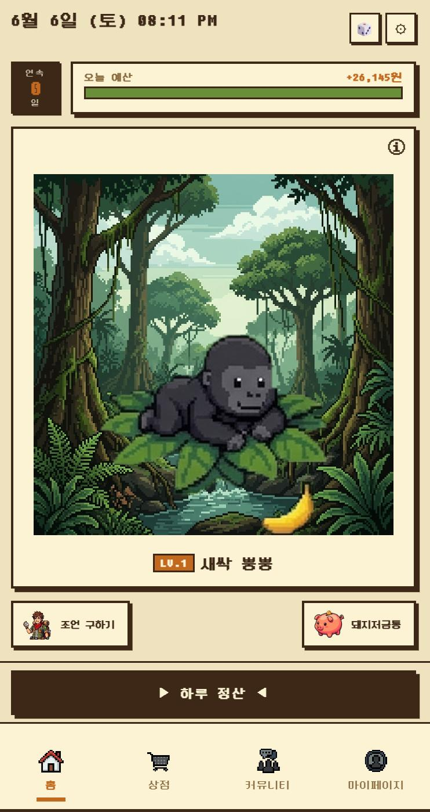
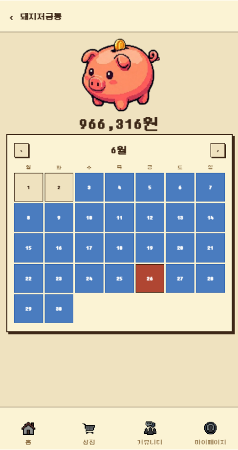
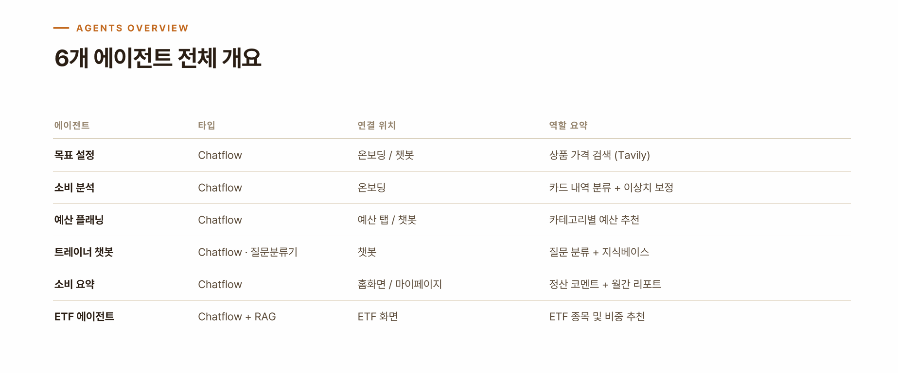

# 주머니 (ZooMoney)

**돈을 모으는 재미를 캐릭터 육성으로.** 목표 상품을 정하면 AI가 하루 예산을 짜주고, 그 예산을 지킬 때마다 캐릭터가 자라는 저축 습관 앱입니다.

> 2026-1 캡스톤 프로젝트 · 기획과 디자인은 팀원과 함께, 프론트엔드 구현과 Dify AI 에이전트 설계는 **1인 개발**로 맡았습니다. Claude Code를 활용해 구현하고, 아키텍처 설계와 검증은 직접 주도했습니다.

<p align="center">
  
  
  
  
  
</p>

**🔗 라이브 데모**: https://hyunbean.github.io/ZooMoney/
> API 키는 보안상 배포에 포함하지 않습니다. 라이브 데모의 AI 기능은 **Cloudflare Worker 게이트웨이**(`gateway/`)를 통해 동작하도록 설계되어 있습니다 — 키는 Worker secret에만 존재하고, 프론트는 에이전트 이름만 보냅니다. 게이트웨이가 배포되지 않은 동안에는 AI 기능만 조용히 비활성화되고 저축·캐릭터 로직은 전부 체험할 수 있습니다. 로컬에서 직접 키를 설정하는 방법은 [아래 참고](#dify-ai-기능-연동하기).

---

## 한눈에 보기

- **AI 온보딩** — 갖고 싶은 상품을 말하면 Dify 에이전트가 실시간 웹 검색(Tavily)으로 가격을 찾아오고, 카드 지출 내역을 업로드하면 자동으로 카테고리 분류·이상치 탐지까지 해서 하루 예산을 설계해줍니다.
- **캐릭터 육성형 동기부여** — 8종 동물 캐릭터가 저축 진행률에 따라 5단계로 성장하고, 예산을 못 지킨 다음 날엔 표정이 시무룩해집니다. 22종 배지와 연속 출석 스트릭으로 계속 돌아오게 만듭니다.
- **AI 트레이너 챗봇** — 절약 팁, 충동구매 상담, 목표 변경, 실시간 예산 계산까지 인텐트를 분류해 대응하는 대화형 코치.
- **AI 예산 분석** — 카테고리별 지출을 분석해 절감 가능한 예산을 제안합니다.
- **소셜** — 친구 추가, 예산 성공률 랭킹, 절약 인증 피드, 공동 목표 그룹.

기능별 자세한 설명은 [FEATURES.md](FEATURES.md)에 정리해뒀습니다.

---

## 한계 (Limitations)

- **카드 소비분석 결과가 실제 예산 계산에 반영되지 않음** → 실제 카드사/은행 API 연동 없이 목업 소비 데이터(`CARD_EXPENSES`)로 "업로드 → AI 분석" 경험만 재현했기 때문 (MVP 범위). Dify 소비분석 에이전트의 대화는 실제로 진행되지만 결과 JSON은 채팅 UX 표시용이고, 카테고리 집계는 별도의 로컬 규칙 기반 분류기가 수행함 → 실제 카드사 API를 연동하고 로컬 분류기를 Dify 결과로 교체하면 해소됨 (자세한 내용은 [FEATURES.md](FEATURES.md) 온보딩 3단계 참고).
- **트레이너 챗봇이 정상 질문(class-2, 충동구매 상담)을 무관 질문(class-6)으로 거절하는 오분류가 재현됨** → 애초 질문분류기 프롬프트의 class-2 라벨 설명이 좁았고(예: "참다"라는 표현이 트리거에 없었음) 명시적인 분류 지침(instruction)도 비어 있었기 때문 → 2026-07-27 커밋(`5f84da3`)에서 class-2 라벨을 확장하고 "애매하면 class-6보다 1~5를 우선하라"는 instruction을 추가해 대응했으나, 수정 후 전체 골든셋 재검증 기록은 남아있지 않음 (자세한 내용은 [`eval/README.md`](eval/README.md) 참고).
- **인텐트 분류 정확도 측정이 정상↔거절 경계만 판정하고 class 1~5 사이의 세부 오분류는 잡지 못함** → 거절 응답이 고정 문구로만 식별 가능해, 예를 들어 절약팁 질문이 예산분석으로 잘못 분류돼도 둘 다 "정상 처리"라 구분되지 않기 때문 → 세부 클래스별 정답 라벨을 골든셋에 추가하고 클래스 단위 정확도를 측정하면 해소됨.
- **인텐트 분류 골든셋(20문항 × 3회)을 게이트웨이 경유로는 완주하지 못함** → Cloudflare Worker 게이트웨이의 IP당 하루 40회 호출 한도(남용 방지 장치)에 걸리기 때문 → 로컬에서 Dify API 키를 직접 쓰는 `eval/run_intent_eval_local.py`(한도 없음)로 전환하면 해소되지만, 이 경로로 완주된 결과는 아직 기록되지 않음.
- **Dify DSL export의 RAG 지식베이스 연결(`dataset_ids`)이 비어 있음** → 원 워크스페이스의 지식베이스 ID가 공개 저장소에 노출되는 것을 막기 위해 export 시 제거했기 때문 → 임포트한 사용자가 본인 지식베이스를 만들어 소비분석·예산플래닝·트레이너챗봇의 Knowledge Retrieval 노드에 직접 연결하면 해소됨.

---

## 기술 스택

| 영역 | 사용 기술 |
|---|---|
| 프론트엔드 | Vanilla JS (프레임워크 없음), CSS Custom Properties |
| 상태 관리 | 자체 pub/sub 상태 관리자 (`js/state.js`) + `localStorage` 영속화 |
| AI | [Dify](https://dify.ai) 워크플로 6종 (GPT-4o-mini 기반, Tavily 웹검색·RAG 지식베이스 연동) |
| 테스트 | Node.js 내장 테스트 러너 (`node --test`) |
| AI 게이트웨이 | Cloudflare Worker (`gateway/`) — 키 은닉 · IP별 호출 한도 · 토큰/비용 로깅 |

바닐라 JS로 프레임워크 없이 만든 이유는 빠른 프로토타이핑과, AI 에이전트와의 상태 흐름을 직접 손으로 설계해보기 위해서입니다.

### Dify 에이전트 아키텍처

6개 워크플로 전부 Dify(Chatflow 기반)로 설계했고, GPT-4o-mini + Tavily 웹검색 + Cohere RAG 지식베이스를 조합해 구성했습니다.

<p align="center">
  
</p>

| 에이전트 | 연결 파일 | 역할 | Dify DSL |
|---|---|---|---|
| 목표설정 | `js/screens/onboarding.js` | 상품 실시간 가격 검색 (Tavily) | [goal-setting.yml](dify/goal-setting.yml) |
| 소비분석 | `js/screens/onboarding.js` | 카드 내역 → 카테고리 분류 + 이상 지출 탐지 | [spending-analysis.yml](dify/spending-analysis.yml) |
| 예산플래닝 | `js/screens/budget.js` | 카테고리별 예산 추천 + 저축 부족분 자동 조정 | [budget-planning.yml](dify/budget-planning.yml) |
| 트레이너 챗봇 | `js/screens/trainer_chat.js` | 인텐트 분류 + 지식베이스 연동 대화 | [trainer-chat.yml](dify/trainer-chat.yml) |
| 소비요약 | `js/modals.js`, `js/screens/mypage.js` | 하루 정산 코멘트 + 월간 소비 리포트 | [spending-summary.yml](dify/spending-summary.yml) |

`dify/` 폴더의 DSL은 Dify 콘솔에서 그대로 임포트해 워크플로 구조·프롬프트·모델 설정을 확인할 수 있습니다. 단, RAG 노드의 `dataset_ids`는 원 워크스페이스에 묶인 값이라 export에서 비워뒀습니다 — 임포트 후 본인 지식베이스(절약팁 문서)를 만들어 소비분석·예산플래닝·트레이너챗봇의 Knowledge Retrieval 노드에 연결해야 RAG가 동작합니다.

---

## 실행 방법

정적 웹앱이라 별도 빌드 과정 없이 로컬 서버 하나로 실행됩니다.

```bash
# 프로젝트 루트에서
python -m http.server 3000
# 브라우저에서 http://localhost:3000 접속
```

### Dify AI 기능 연동하기

이 저장소에는 실제 API 키가 들어있지 않습니다 (보안상 `.gitignore` 처리). 직접 돌려보려면:

```bash
cp js/config.example.js js/config.js
```

그리고 [Dify](https://dify.ai)에서 워크플로 앱을 만든 뒤 발급받은 API 키를 `js/config.js`에 채워 넣으세요. 키가 없어도 앱 자체는 정상 실행되며, AI 관련 화면(온보딩 가격검색, 트레이너 챗봇 등)만 응답하지 않습니다.

### AI 게이트웨이 (배포용, `gateway/`)

라이브 데모처럼 키를 배포에 포함할 수 없는 환경에서는 Cloudflare Worker 게이트웨이를 사용합니다.

```
프론트(에이전트 이름만 전송) → Worker(/chat) → Dify API (키는 Worker secret)
```

- **키 은닉** — Dify 키 6종은 `wrangler secret`으로만 등록, 코드·배포 산출물에 미포함
- **남용 방지** — IP당 하루 40회 한도 (Workers KV 카운터, 초과 시 429)
- **관측성** — 요청별 에이전트·지연시간·토큰 사용량·비용을 구조화 로그로 기록 (`wrangler tail`)
- **폴백** — 게이트웨이 미배포/실패 시 AI 카드만 비활성화, 앱 로직은 정상 동작

배포 절차는 [`gateway/wrangler.toml`](gateway/wrangler.toml) 주석에 정리되어 있고, 배포 후 발급된
Worker URL을 [`js/config.public.js`](js/config.public.js)의 `DIFY_GATEWAY_URL`에 넣으면
라이브 데모에서도 AI 기능이 활성화됩니다.

### 테스트

```bash
node --test "tests/*.test.mjs"
```

상태 관리 로직(예산 계산, 하루 정산, 뱃지 획득 조건 등)에 대한 유닛테스트 16개가 포함되어 있습니다. 전역 `<script>` 구조라 `node:vm`의 `runInContext`로 `AppState`를 꺼내 검증합니다 (`tests/setup.mjs`).

---

## 프로젝트 구조

```
├── index.html
├── css/                    # 화면·컴포넌트·애니메이션 스타일
├── js/
│   ├── app.js              # 엔트리: 부팅 · 라우팅 · 이벤트 연결
│   ├── state.js            # 전역 상태 관리 (pub/sub + localStorage)
│   ├── characters.js       # 8종 캐릭터 스프라이트 시스템
│   ├── config.example.js   # Dify API 키 설정 템플릿 (로컬용)
│   ├── config.public.js    # 게이트웨이 모드 공개 기본값 (라이브 데모용)
│   ├── data/mock.js        # 커뮤니티 피드/그룹/랭킹 목업 데이터
│   └── screens/            # 화면별 렌더링 (온보딩, 홈, 목표, 저금통,
│                            #   마이페이지, 커뮤니티, 트레이너챗봇, 예산, 상점)
├── tests/                  # node --test 유닛테스트
├── images/, fonts/         # 캐릭터 스프라이트, 픽셀 폰트(DungGeunMo)
├── gateway/                # Cloudflare Worker AI 게이트웨이 (키 은닉·한도·로깅)
├── dify/                   # Dify 에이전트 6종 DSL(yml) 원본
└── FEATURES.md             # 기능 상세 문서
```

---

## 만든 사람

기획과 디자인은 팀원과 함께 작업했고, 프론트엔드 구현과 Dify AI 에이전트 설계는 혼자 맡았습니다.

## License

[MIT](LICENSE)
